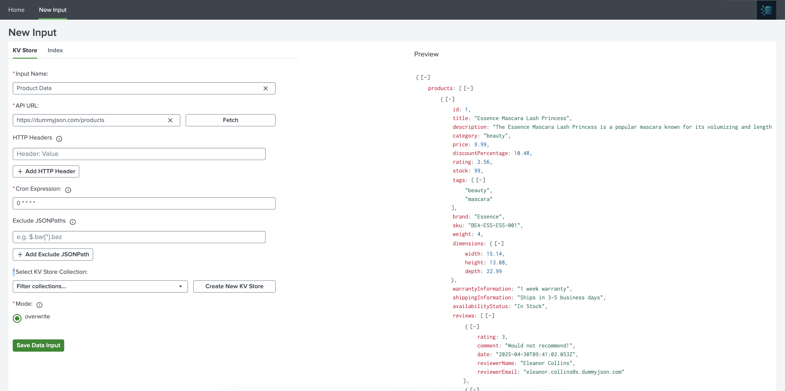
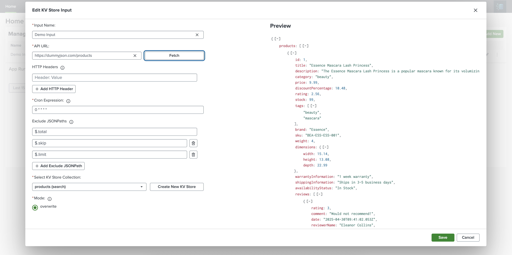
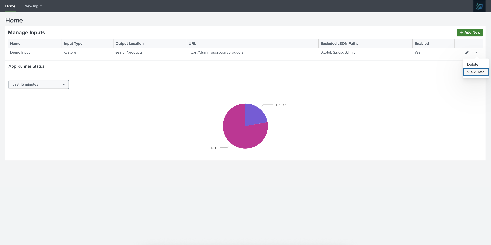

<h1>
  
  Splunk Data Onboarding App
</h1>

This Splunk app simplifies the data onboarding process, especially for non-technical users. It allows users to fetch data from APIs and store it into Splunk KV Stores, with an intuitive UI to preview, pre-process, and manage inputs.

## 🧩 Key Features

- 🔌 Easily onboard data from APIs via a simple form.
- 👀 Preview the structure of your data before storing it.
- 🧹 Apply pre-processing (e.g., exclude unwanted JSON paths).
- 💾 Store the resulting data in Splunk KV Stores.
- 🚀 Designed to be extensible — future support for more input types planned.

## 🖼️ App Pages Overview

<p align="center">
  <a href="https://jacobanderson-public.s3.us-east-1.amazonaws.com/demo.mp4" target="_blank">
    
  </a>
</p>

### 🏠 Home Page

Users can view all configured API inputs and get an overview of the logs for inputs.


### ➕ Add a New API Input

Use this form to define a new API endpoint and preview the data.



### ✏️ Edit an Existing API Input

Modify existing API input settings, such as the endpoint URL or filtering rules.



### 🔧 Input Action Menu

View the KV Store contents or delete the input.



### 📦 Packaging the App

To create a distributable `.tar.gz` file of this Splunk app, use the provided packaging script.

#### 📝 Steps:

1. From the **root of the project directory**, run:

```bash
./scripts/package.sh
```

> ⚠️ **Important:** This script must be executed from the root of the project

#### 📁 What It Does

- Bundles the app into a `.tar.gz` file so you can then upload the `.tar.gz` file to your Splunk instance via:

        Apps > Manage Apps > Install app from file**

## 🛠️ Installation

The app package is located here [api_input_connect.tar.gz](api_input_connect.tar.gz)

## 🔄 Roadmap

The current MVP supports JSON data from API sources, filtered via simple exclusion logic.

Planned features include:

- 🧪 Advanced data pre-processing (e.g., renaming, transformation)
- 🧩 Push data directly to indexes or other output types
- 🔌 Convert script to a modular input to be Splunk Cloud friendly

## 📣 Feedback & Contributions

Have ideas? Found a bug? Want to contribute? Let us know! This app is meant to grow.
